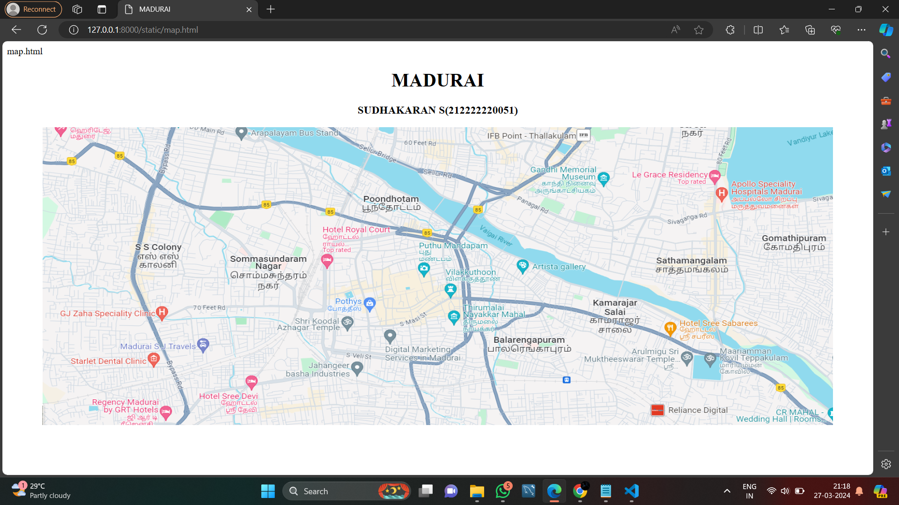
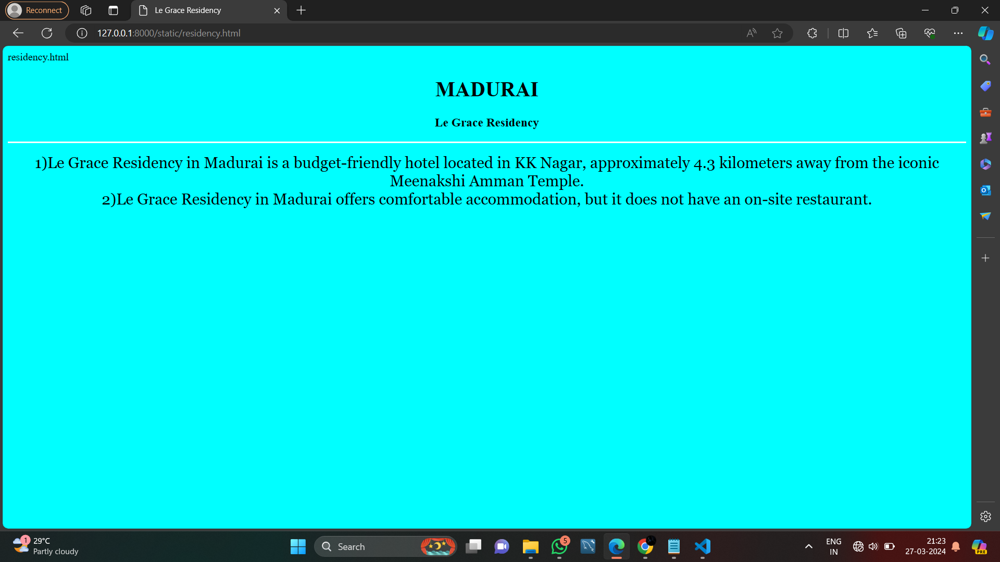
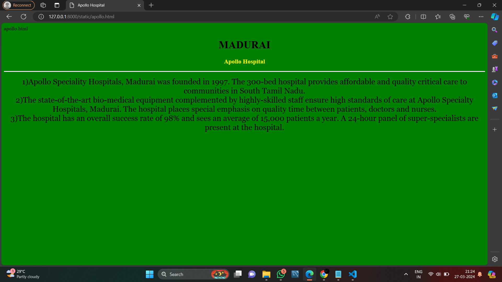
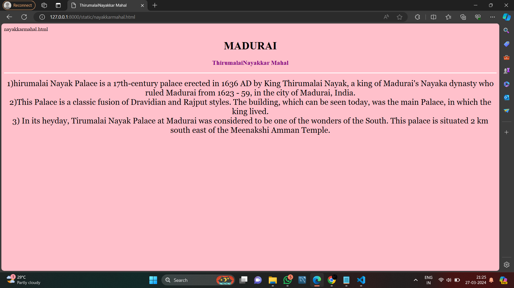
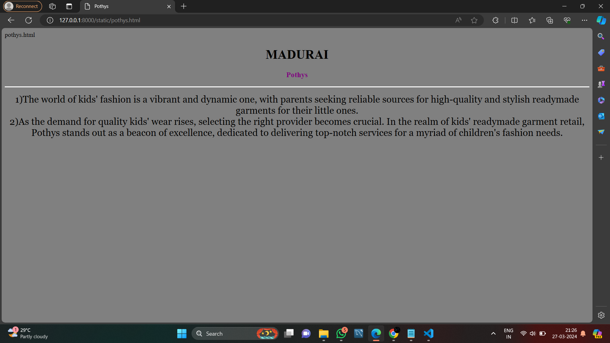
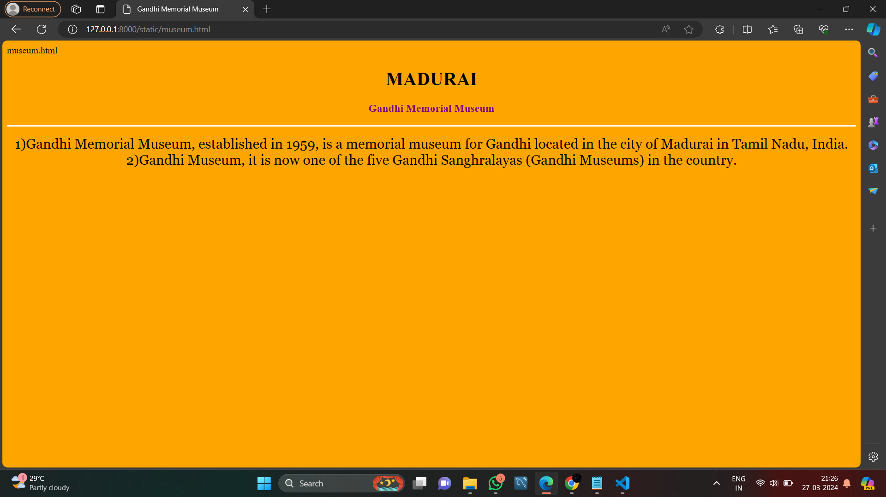

# Ex04 Places Around Me
## Date: 20.03.2024

## AIM
To develop a website to display details about the places around my house.

## DESIGN STEPS

### STEP 1
Create a Django admin interface.

### STEP 2
Download your city map from Google.

### STEP 3
Using ```<map>``` tag name the map.

### STEP 4
Create clickable regions in the image using ```<area>``` tag.

### STEP 5
Write HTML programs for all the regions identified.

### STEP 6
Execute the programs and publish them.

## CODE

```
map.html

<!DOCTYPE html>
<html>
<head>
<title>MADURAI</title>
</head>
<body>
<h1 align="center"><b>MADURAI</b></h1>
<h3 align="center"><b> SUDHAKARAN S(212222220051)</b></h3>
<center>


<map name="image-map">
    <area target="" alt="Le Grace Residency" title="Le Grace Residency" href="residency.html" coords="1374,111,32" shape="circle">
    <area target="" alt="Apollo Hospital" title="Apollo Hospital" href="apollo.html" coords="1399,176,29" shape="circle">
    <area target="" alt="ThirumalaiNayakkar Mahal" title="ThirumalaiNayakkar Mahal" href="nayakkarmahal.html" coords="851,452,33" shape="circle">
    <area target="" alt="Pothys" title="Pothys" href="pothys.html" coords="644,416,30" shape="circle">
    <area target="" alt="Gandhi Memorial Museum" title="Gandhi Memorial Museum" href="museum.html" coords="1154,145,27" shape="circle">
</map>
</center>
</body>
</html>

residency.html

<!DOCTYPE html>
<html>
<head>
<title>Le Grace Residency</title>
</head>
<body bgcolor="cyan">
<h1 align="center"><b>MADURAI</b></h1>
<h3 align="center"><b>Le Grace Residency</b></h3>
<hr size="3" color="white">
<p align="center">
<font face="Georgia" size="5">
 1)Le Grace Residency in Madurai is a budget-friendly hotel located in KK Nagar, approximately 4.3 kilometers away from the iconic Meenakshi Amman Temple.<br>
2)Le Grace Residency in Madurai offers comfortable accommodation, but it does not have an on-site restaurant.
</p>
</body>
</html>

apollo.html

<!DOCTYPE html>
<html>
<head>
<title>Apollo Hospital</title>
</head>
<body bgcolor="green">
<h1 align="center">
<font color="black"><b>MADURAI</b></font>
</h1>
<h3 align="center">
<font color="yellow"><b>Apollo Hospital</b></font>
</h3>
<hr size="3" color="white">
<p align="center">
<font face="Georgia" size="5">
1)Apollo Speciality Hospitals, Madurai was founded in 1997. The 300-bed hospital provides affordable and quality critical care to communities in South Tamil Nadu.<br>
2)The state-of-the-art bio-medical equipment complemented by highly-skilled staff ensure high standards of care at Apollo Specialty Hospitals, Madurai. The hospital places special emphasis on quality time between patients, doctors and nurses.<br>
3)The hospital has an overall success rate of 98% and sees an average of 15,000 patients a year. A 24-hour panel of super-specialists are present at the hospital.
</p>
</body>
</html>

nayakkarmahal.html

<!DOCTYPE html>
<html>
<head>
<title>ThirumalaiNayakkar Mahal</title>
</head>
<body bgcolor="pink">
<h1 align="center">
<font color="black"><b>MADURAI</b></font>
</h1>
<h3 align="center">
<font color="purple"><b>ThirumalaiNayakkar Mahal</b></font>
</h3>
<hr size="3" color="white">
<p align="center">
<font face="Georgia" size="5">
1)hirumalai Nayak Palace is a 17th-century palace erected in 1636 AD by King Thirumalai Nayak, a king of Madurai's Nayaka dynasty who ruled Madurai from 1623 - 59, in the city of Madurai, India.<br>
2)This Palace is a classic fusion of Dravidian and Rajput styles. The building, which can be seen today, was the main Palace, in which the king lived.<br>
3) In its heyday, Tirumalai Nayak Palace at Madurai was considered to be one of the wonders of the South. This palace is situated 2 km south east of the Meenakshi Amman Temple.
</p>
</body>
</html>

pothys.html

<!DOCTYPE html>
<html lang="en">
<head>
<title>Pothys</title>
</head>
<body bgcolor="gray">
<h1 align="center">
<font color="black"><b>MADURAI</b></font>
</h1>
<h3 align="center">
<font color="purple"><b>Pothys</b></font>
</h3>
<hr size="3" color="white">
<p align="center">
<font face="Georgia" size="5">
1)The world of kids' fashion is a vibrant and dynamic one, with parents seeking reliable sources for high-quality and stylish readymade garments for their little ones.<br>
2)As the demand for quality kids' wear rises, selecting the right provider becomes crucial. In the realm of kids' readymade garment retail, Pothys stands out as a beacon of excellence, dedicated to delivering top-notch services for a myriad of children's fashion needs.
</p>
</body>
</html>

museum.html

<!DOCTYPE html>
<html lang="en">
<head>
<title>Gandhi Memorial Museum</title>
</head>
<body bgcolor="orange">
<h1 align="center">
<font color="black"><b>MADURAI</b></font>
</h1>
<h3 align="center">
<font color="purple"><b>Gandhi Memorial Museum</b></font>
</h3>
<hr size="3" color="white">
<p align="center">
<font face="Georgia" size="5">
1)Gandhi Memorial Museum, established in 1959, is a memorial museum for Gandhi located in the city of Madurai in Tamil Nadu, India.<br>
2)Gandhi Museum, it is now one of the five Gandhi Sanghralayas (Gandhi Museums) in the country.
</p>
</body>
</html>

```

## OUTPUT








## RESULT
The program for implementing image maps using HTML is executed successfully.
